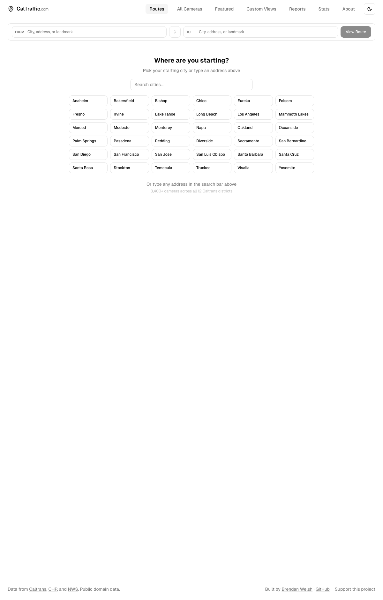

<p align="center">
  
  
  
  
  
</p>

<h1 align="center">CalTraffic</h1>
<p align="center"><strong>Real-time California traffic cameras, incidents, and road conditions</strong></p>
<p align="center">
  <a href="https://caltraffic.com">caltraffic.com</a>
</p>

<p align="center">
  
</p>

---

## About

CalTraffic is a full-featured web application for browsing 3,400+ live Caltrans traffic cameras across all 12 California districts. It includes a route planner that shows cameras along your drive, live CHP incident feeds, NWS weather alerts, a Watch Room for monitoring multiple feeds simultaneously, and historical image playback. All camera data is sourced from Caltrans CWWP2 public domain feeds.

This is the most complex project in the portfolio — a proper Astro + React app with Cloudflare Workers API endpoints, caching, rate limiting, and circuit breakers.

## Features

### Camera Browsing
- **3,400+ Live Cameras** — Browse every Caltrans CCTV camera organized by district, route, and location
- **Camera Grid** — Thumbnail grid with adjustable density control (compact → spacious)
- **Camera Detail Dialog** — Full-size live view with HLS video streaming via hls.js
- **Historical Images** — Scrub through past camera snapshots to see how conditions changed
- **Favorites** — Star cameras for quick access, persisted in localStorage
- **Search & Filter** — Filter by route, keyword, camera status, and district

### Route Planning
- **Route Planner** — Enter FROM and TO locations to see every camera along your drive
- **Route Camera List** — Cameras displayed in driving order with distance markers
- **Route Map View** — Interactive Leaflet map showing your route with camera pins
- **Route Live View** — All cameras on your route displayed as a scrollable feed
- **City Quick-Pick** — 30+ California cities as starting point shortcuts

### Watch Room
- **Multi-Camera Monitoring** — Watch up to 6 camera feeds simultaneously in configurable layouts
- **Layout Presets** — 1-up, 2x2, 3x2 grid layouts
- **Slot Rotation** — Auto-rotate cameras in each slot on a timer
- **Shareable Links** — Share your Watch Room configuration via URL

### Incidents & Weather
- **CHP Live Incidents** — Real-time California Highway Patrol incident feed with severity badges
- **Incident Map** — Interactive map with incident pins, filterable by type
- **NWS Weather Alerts** — National Weather Service alerts for California displayed as banners
- **Traffic Reports** — Aggregated road condition reports

### Additional Features
- **Featured Cameras** — Curated collections (scenic routes, mountain passes, major corridors)
- **Stats Page** — Camera counts by district, route coverage, data freshness metrics
- **District Map Selector** — Visual map for picking Caltrans districts
- **CMS Signs** — Changeable Message Sign data display
- **Dark Mode** — Toggle between light and dark themes
- **Responsive** — Full mobile support with adapted layouts

## Architecture

```
Browser (Astro + React)
  |
  |  SWR data fetching
  v
Cloudflare Workers (API Layer)
  |
  |  /api/cameras/[district]     — Camera feeds by district
  |  /api/incidents              — CHP incident data
  |  /api/rwis/[district]        — Road Weather Info System
  |
  |  Built-in middleware:
  |    - Rate limiter (per-IP)
  |    - Circuit breaker (upstream failures)
  |    - Response caching
  |    - XML parser (Caltrans feeds are XML)
  v
Caltrans CWWP2  |  CHP API  |  NWS API
```

## Tech Stack

| Layer | Technology |
|-------|-----------|
| Framework | [Astro](https://astro.build) with React islands |
| UI | React 18, [shadcn/ui](https://ui.shadcn.com), Tailwind CSS |
| State | [nanostores](https://github.com/nanostores/nanostores) with React bindings |
| Data Fetching | [SWR](https://swr.vercel.app) for client-side caching + revalidation |
| Maps | [Leaflet](https://leafletjs.com) + [React Leaflet](https://react-leaflet.js.org) |
| Video | [hls.js](https://github.com/video-dev/hls.js) for live camera HLS streams |
| API | Cloudflare Pages Functions (Workers runtime) |
| Validation | [Zod](https://zod.dev) for API response schemas |
| Styling | Tailwind CSS + [CVA](https://cva.style) for variant management |
| Icons | [Lucide React](https://lucide.dev) |
| Fonts | Geist Variable via @fontsource |
| Testing | Vitest + Testing Library + Playwright |
| Hosting | Cloudflare Pages |

## Project Structure

```
caltraffic.com/
  src/
    components/
      astro/                   # Astro components (Header, Footer)
      react/                   # React components (40+ files)
        CameraGrid.tsx         # Main camera browsing grid
        CameraDetailDialog.tsx # Full-size camera viewer
        VideoPlayer.tsx        # HLS video player
        WatchRoom.tsx          # Multi-camera monitoring
        RoutePlanner.tsx       # Route planning interface
        IncidentMap.tsx        # CHP incidents on map
        MapView.tsx            # Leaflet map wrapper
        ...
      ui/                      # shadcn/ui primitives
    pages/                     # Astro page routes
    stores/                    # Nanostores state management
    lib/                       # Shared utilities
  functions/
    api/
      cameras/[district].ts    # Camera data endpoint
      incidents.ts             # CHP incidents endpoint
      rwis/[district].ts       # Road weather endpoint
    lib/
      cache.ts                 # Response caching layer
      rate-limiter.ts          # Per-IP rate limiting
      circuit-breaker.ts       # Upstream failure protection
      xml-parser.ts            # Caltrans XML feed parser
      fetch-upstream.ts        # Resilient upstream fetcher
  public/                      # Static assets
  docs/                        # Documentation
  preview.png                  # Screenshot for this README
  CLAUDE.md                    # AI assistant context
  README.md                    # You are here
```

## Development

```bash
npm install
npm run dev          # Start dev server (http://localhost:4321)
npm run build        # Build for production
npm run preview      # Preview production build
npm test             # Run Vitest tests
npm run lint         # TypeScript + Astro check
```

## Deploy

```bash
npm run build
wrangler pages deploy dist/ --project-name=caltraffic
```

## Data Sources

| Source | Data | Update Frequency |
|--------|------|-----------------|
| **Caltrans CWWP2** | CCTV cameras, CMS signs, chain control, lane closures, RWIS, travel times | ~5 min |
| **CHP** | Live traffic incidents across California | Real-time |
| **NWS** | Weather alerts and warnings | As issued |

All data is sourced from public domain government feeds.

## License

Private project. All rights reserved.
